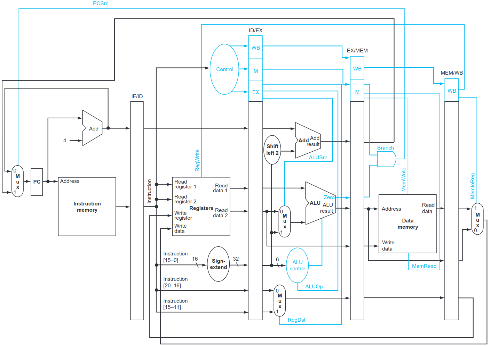
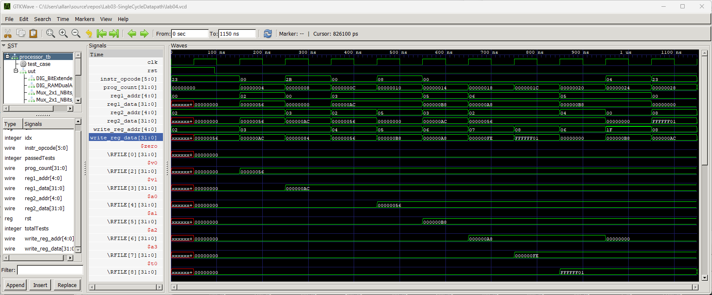

# Lab 05 - Pipelined Datapath

## Introduction

I previously mentioned that I was not sure why the book for this course discusses a pipeline for based on the single cycle
datapath. The main idea behind a pipeline is to reduce the number of cycles that an instruction takes to execute. However,
the single cycle datapath only takes one cycle, you cannot take less than that (OK, you can with parallelism, but that's
another chapter). The instruduction of a pipeline to the single cycle datapath results in most instructions taking four
cycles to execute. This result is the opposite of the goal of pipelining.

Here's a diagram of the pipelined datapath:



Recently, though, I figured out why they discuss the pipline in the context of the Single Cycle Datapath. If you read 
further in the chapter that discusses pipelining (ch. 4), they also discuss hazards. This concept is important to 
understanding how modern processors, which try to execute multiple instructions per cycle, can avoid issues that come up
when you introduce concurrency.

The goal of this lab assignment, therefore, is to better understands the different types of hazards, and understand why they
are required. You will not implement any Verilog modules or do any schematic capture in Digital. Rather, you will be given a 
design that implements a pipeline and observe data hazards as they occur, and discuss solutions to these hazards. You will
not need to implement these techniques, but you will determine the output of the same program from the previous lab assignment
and how it differs when a pipeline is introduced. The program from the last lab assingment is in [`init.asm`](./init.asm) and looks like the
following:

```asm
lw $v0 31($zero)
add $v1 $v0 $v0
sw $v1 132($zero)
sub $a0 $v1 $v0
addi $a1 $v1 12
and $a2 $a1 $v1
or $a3 $a2 $v0
nor $t0 $a2 $v0
slt $a2 $a1 $a0
beq $a2 $zero -8
lw $t0 132($zero)
```

This code works perfectly fine in the single cycle datapath with no pipeline, but has several data hazards when run on the same
datapath with a pipeline. Your goal for this lab is to find what the output is like for the pipelined version, and discuss why
the state of the registers and memory is different and what types of hazards caused the differences. You will also be asked for
a small code change to avoid a stall.

The concepts of Hazards is discussed in the recommended textbook for this class, and the textbook for CS 161. However, I've 
provided the sections pertaining to hazards in this lab assignment. Before starting this lab read sections 5 through 8 in 
chapter of the book provided [here](./assets/CH4-PipelinesAndHazards.pdf). Section 5 covers the concepts behind pipelines and 
describes the types of hazards. Sections 7 and 8 talk about how to overcome these hazards in the pipeline. You may skip section
6. While I will cover much of this material in lecture, I highly recommend reading this material to better understand how to 
complete this lab.

## Deliverables 
For this lab, you will not implement any new datapath components, or wire up provided compenents. Instead you will use Digital
and Iverilog, if you wish, to simulate running the assembly code above in [`init.asm`](./init.asm). I have provided the 
pipelined datapath in [`lab05_pipelined.dig`](./lab05_pipelined.dig). Simulate the circuit like you have in past labs and note 
the values for the outputs of the MIPS processor, similar to those from the preveious lab.

For example, if you run the code in `init.asm` in the schematic capture design of the single cycle datapath from the last lab 
over the course of running the 11 instructions in 11 cycles you will get the following outputs:

| PC | Opcode | src1_addr | src1_out   | src2_addr | src_out    |dst_addr | dst_data   |
|---:|-------:|----------:|-----------:|----------:|-----------:|--------:|-----------:|
|   0| 0x23   | 0         | 0x00000000 | 2         | 0x00000000 | 2       | 0x00000056 |
|   4| 0x00   | 2         | 0x00000056 | 2         | 0x00000056 | 3       | 0x000000AC |
|   8| 0x2B   | 0         | 0x00000000 | 3         | 0x000000AC | 3       | 0x00000084 |
|  12| 0x00   | 3         | 0x000000AC | 2         | 0x00000056 | 4       | 0x00000056 |
|  16| 0x08   | 3         | 0x000000AC | 5         | 0x00000000 | 5       | 0x000000B8 |
|  20| 0x00   | 5         | 0x000000B8 | 3         | 0x000000AC | 6       | 0x000000A8 |
|  24| 0x00   | 6         | 0x000000A8 | 2         | 0x00000056 | 7       | 0x000000FE |
|  28| 0x00   | 6         | 0x000000A8 | 2         | 0x00000056 | 8       | 0xFFFFFF01 |
|  32| 0x00   | 5         | 0x000000B8 | 4         | 0x00000056 | 6       | 0x00000000 |
|  36| 0x04   | 5         | 0x000000B8 | 0         | 0x00000000 | 31      | 0x000000B8 |
|  40| 0x23   | 0         | 0x00000000 | 8         | 0xFFFFFF01 | 8       | 0x000000AC |


You can verify this table using the following waveform:



For this lab you will produce the same table for running the program in `labo5_pipeliend.dig` in Digital. However, for this version of the datapath you will
need to run the program for 15 cycles to execute the 11 instructions. Why? Because the pipeline will cause the execuction of the program to take 4 cycles longer.
As part of your report, produce a table similar to the above, but for this version of the datapath. Also, think about why the values in the table are different.
Your hint is the content of the book that I gave you. There are data hazards that come up when running this code in the pipelined datapath.

If you wish to produce a waveform similar to the one above for the pipelined datapath to help you build this table then follwing these directions:
1. In Digital, with `lab05_pipelined.dig` opened, go to Export -> Export To Verilog and save the verilog file as `lab05_pipelined.v`
2. Synthesize the provided test-bench with the command: `iverilog -o lab05_tb lab05_tb.v lab05_pipelined.v`
3. Run the sythesized simulation with the command: `vvp lab05_tb` and ignore the output.
4. Now open the waverform in GTKWave by going to File -> Open New Tab and navigate to and open `lab05.vcd` which was produced when you ran the test-bench
5. Open the save file so you can see all the values for the wave form. Go to File -> Read Save File and navigate to and select the file `lab05.gtkw`.
6. Click on the mangifying class to the left of the ones with the '+' and '-' signs. This will zoom into the entire run of the test-bench. 

Just like for the waveform above, you can use this waveform to find the values for the table you need to produce. 

This step is not required, but might be very helpful in understanding how the pipeline works and how to get the proper output values for the lab report

### The Lab Report

Finally, create a file called REPORT.md and use GitHub markdown to write your lab report. This lab
report will contain 3 short sections. 

Section 1 will contain the table you produced with the outputs when running the program `init.asm` in the pipelined datapath in Digital. It should contain 15
rows for the 15 cycles required to execute the 11 instructions.

Section 2 will then contain a brief explanation of why this table you produced for the pipelined datapath differs from the output for the non-pipelined datapath.
The program is the same, so the output should be the same. However, hazards have caused the output to diverge from what is expected. You don't need to describe 
each hazard, but explain maybe one or two hazards that occur and what type of hazard are the, sturcturla, data or control.

Section 3 will then contain a single MIPS assembly instruction. This instruction would be inserted between the first and second instruction in the program to avoid
either a stall or a hazard. It can be any instruction as long as it doesn't change the outcome of th program if the pipelined datapath had been implemented with 
hazard detection and forwarding components, in other words, the program would have the same output as the non-pipelined datapath. (_HINT_ it can be any instruction
preferably R-Type that does not have $v0 as the destination register). Then indicate whether this instruction would help to avoid a stall, hazard or both.

## Submission:
Each student **must** turn in their repository from GitHub to Gradescope. The contents of which should be:
- A REPORT.md file with your name and email address, and the content described above
- All Verilog file(s) used in this lab.

**If your file does not synthesize or simulate properly, you will receive a 0 on the lab.**