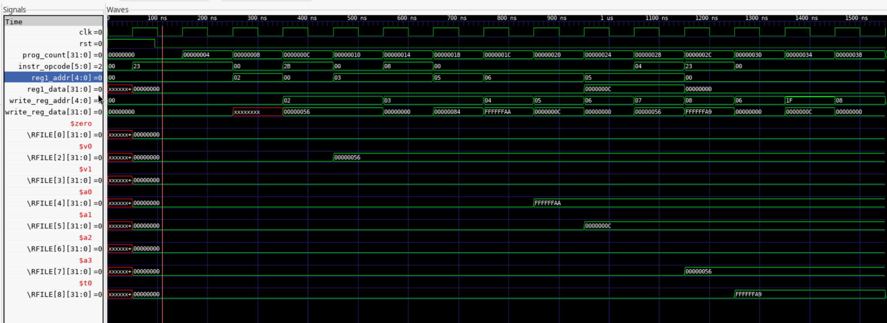

# Section 1
```
PC: 00000000 | opcode: 23 | reg1_addr:  0 | reg1_data: xxxxxxxx | write reg addr:  0 | write reg data: 00000000
PC: 00000004 | opcode: 23 | reg1_addr:  0 | reg1_data: 00000000 | write reg addr:  0 | write reg data: 00000000
PC: 00000008 | opcode: 00 | reg1_addr:  2 | reg1_data: 00000000 | write reg addr:  0 | write reg data: xxxxxxxx
PC: 0000000c | opcode: 2b | reg1_addr:  0 | reg1_data: 00000000 | write reg addr:  2 | write reg data: 00000056
PC: 00000010 | opcode: 00 | reg1_addr:  3 | reg1_data: 00000000 | write reg addr:  2 | write reg data: 00000056
PC: 00000014 | opcode: 08 | reg1_addr:  3 | reg1_data: 00000000 | write reg addr:  3 | write reg data: 00000000
PC: 00000018 | opcode: 00 | reg1_addr:  5 | reg1_data: 00000000 | write reg addr:  3 | write reg data: 00000084
PC: 0000001c | opcode: 00 | reg1_addr:  6 | reg1_data: 00000000 | write reg addr:  4 | write reg data: ffffffaa
PC: 00000020 | opcode: 00 | reg1_addr:  6 | reg1_data: 00000000 | write reg addr:  5 | write reg data: 0000000c
PC: 00000024 | opcode: 00 | reg1_addr:  5 | reg1_data: 0000000c | write reg addr:  6 | write reg data: 00000000
PC: 00000028 | opcode: 04 | reg1_addr:  5 | reg1_data: 0000000c | write reg addr:  7 | write reg data: 00000056
PC: 0000002c | opcode: 23 | reg1_addr:  0 | reg1_data: 00000000 | write reg addr:  8 | write reg data: ffffffa9
PC: 00000030 | opcode: 00 | reg1_addr:  0 | reg1_data: 00000000 | write reg addr:  6 | write reg data: 00000000
PC: 00000034 | opcode: 00 | reg1_addr:  0 | reg1_data: 00000000 | write reg addr: 31 | write reg data: 0000000c
PC: 00000038 | opcode: 00 | reg1_addr:  0 | reg1_data: 00000000 | write reg addr:  8 | write reg data: 00000000
```

# Section 2
This table differs because of some hazards than occurred. For example in the instruction:
```
lw   $v0, 31($zero) 
add  $v1, $v0, $v0 
```
We see that the first instruction stores data into $v0. We then attempt then attempt to use the data in $v0. This causes a hazard due to the dependency of the second instruction on the first instruction. This causes the pipeline to stall and get interrupted. This is called a data hazard.


# Section 3
Inserting the instruction `and $t0, $t0, $zero` would prevent the stall. The hazard and stall would be prevented because it gives the pipeline time to write back data to the registers.